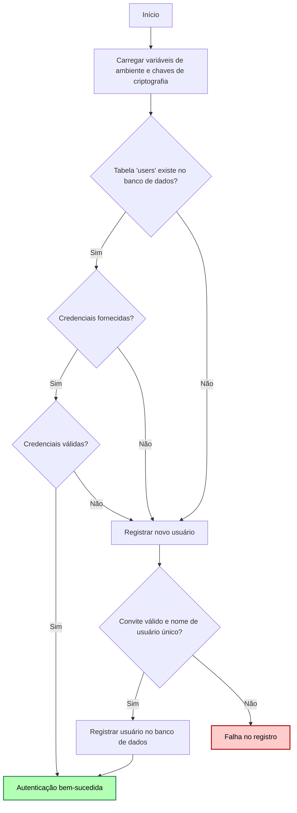

# Projeto de Análise de Dados Agropecuários

Este projeto foi desenvolvido para facilitar a manipulação, análise e visualização de dados relacionados ao setor agropecuário e rural. Ele utiliza ferramentas como Jupyter Notebook, Docker e Python para criar um ambiente eficiente e reprodutível.

## Estrutura do Projeto

-  **`helper.py`**: Script Python auxiliar contendo funções para autenticação, acesso a dados, e integração com APIs e banco de dados.

-  **`main.ipynb`**: Notebook principal que importa o conteúdo de `helper.py` e fornece exemplos de uso das funcionalidades disponíveis.

-  **`.env`**: Arquivo para configuração de variáveis de ambiente (incluído no repositório apenas para facilitar a apresentação, em um cenário normal isso não deve acontecer).

-  **`requirements.txt`**: Lista de dependências Python do projeto.

-  **`docker-compose.yml`**: Configuração de serviços Docker, como PostgreSQL e Redis.

-  **`run.bat`**: Script para inicializar o ambiente e executar o Jupyter Notebook.

## Requisitos
### Certifique-se de que você tem as seguintes ferramentas instaladas:

-  **Python 3.8+**

https://www.python.org/downloads/

 Windows: certifique-se de habilitar a criação do path para o script do python nas variáveis de ambiente na primeira tela do instalador.

-  **Docker**

https://docs.docker.com/get-started/get-docker/

## Configuração do Ambiente
### 1. Configurar Variáveis de Ambiente

Crie um arquivo `.env` na raiz do projeto com as seguintes variáveis:

**`POSTGRES_USER=docker`**

**`POSTGRES_PASSWORD=docker`**

**`POSTGRES_DB=datamaster`**

**`FERNET_KEY=chave_de_fernet`**

**`SIGN_UP_PASSWORD=senha_de_convite`**

### 2. Executar Script de Inicialização do Projeto

Execute o script `run.bat` para configurar automaticamente o ambiente. Ele realiza os seguintes passos:

1. Cria um ambiente virtual Python (`.venv`).

2. Ativa o ambiente virtual e instala as dependências listadas em `requirements.txt`.

3. Inicializa os serviços Docker necessários (PostgreSQL e Redis).

4. Abre o Jupyter Notebook com o arquivo `main.ipynb`.

5. Finaliza os serviços Docker ao encerrar o processo.

### 3. Inicializar Manualmente (Caso não seja possível executar o arquivo run.bat)

#### Criar o ambiente virtual
`python -m venv .venv`

#### Ativar o ambiente virtual
Windows:
`.venv\Scripts\activate`
Mac OS/Linux:
`source .venv/bin/activate`

#### Instalar dependências
`pip install -r requirements.txt`

#### Subir os serviços Docker
lembre-se de estar com o docker aberto antes de executar esse comando
`docker-compose up -d`

#### Abrir o Jupyter Notebook
troque "jupyter notebook" por "jupyter-lab" para acessar a interface completa
`jupyter notebook "main.ipynb"`

#### Finalizar serviços Docker (apenas quando quiser encerrar a aplicação)
`docker-compose down`

#### Desativar o ambiente virtual (apenas quando quiser encerrar a aplicação)
`deactivate`

## Funcionalidades

### O `helper.py` oferece as seguintes funcionalidades:

#### Autenticação de Usuários:

Registro e login utilizando um banco de dados PostgreSQL com senhas criptografadas e Redis para gerenciamento de sessão.

#### Integração com APIs:

Consulta de dados agropecuários usando bibliotecas como ipeadatapy.

#### Gerenciamento de Dados:

Criação e manipulação de tabelas de dados com pandas e integração com bancos de dados PostgreSQL.

#### Visualização de Dados:

Exemplos no Jupyter Notebook mostram como acessar e manipular os dados de forma prática.

## Dependências

As principais bibliotecas usadas no projeto estão listadas em requirements.txt, incluindo:

- `psycopg2-binary` para conexão com PostgreSQL.

- `cryptography` para criptografia de senhas.

- `sqlalchemy` para ORM e consultas ao banco de dados.

- `ipeadatapy` para acessar dados de APIs.

- `jupyterlab` e `notebook` para interface interativa.

## Estrutura do Docker

O arquivo docker-compose.yml configura os seguintes serviços:

- `PostgreSQL`: Banco de dados para armazenamento de informações.

- `Redis`: Sistema de cache para gerenciamento de sessão.

## Uso

#### Se estiver no Windows, execute o script run.bat para iniciar o projeto.

Caso contrário,

#### Siga o passo a passo do item 3 de Configuração do Ambiente

## Autenticação

